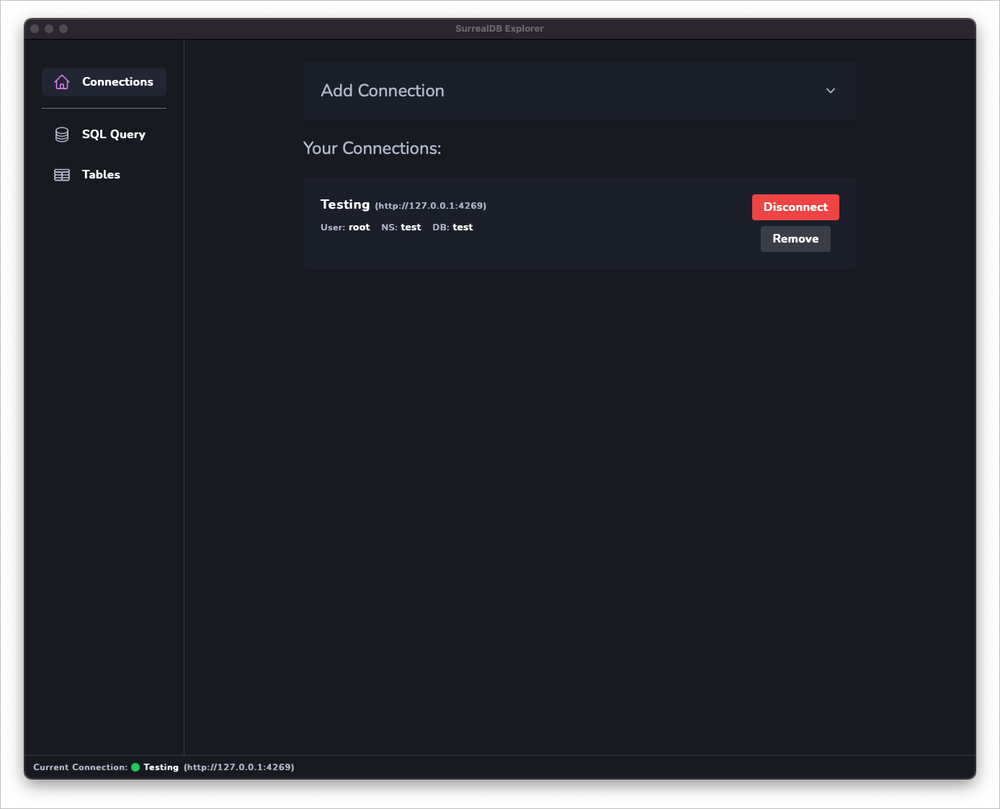
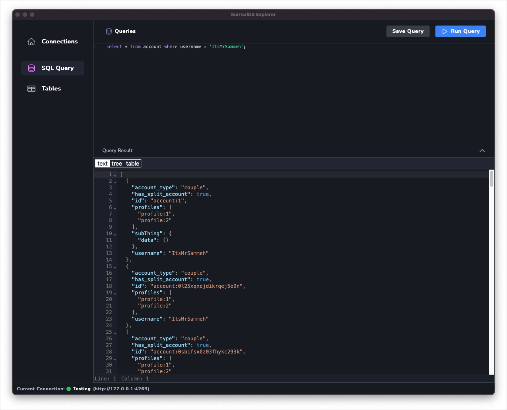
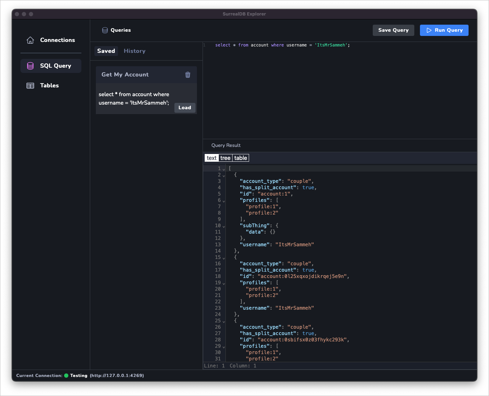
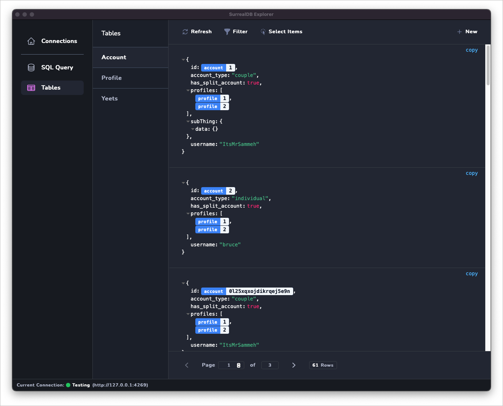

    
    <h1>SurrealDB Explorer</h1>

## Description

SurrealDB Explorer is a simple database viewer/editor for SurrealDB. It's a nice temp solution for a desktop application until the official version is released.

## Features:

- Multiple connection configuration
- Simple query formatting/completion
- Save queries and run them again in the future
- View your tables and their data, create/delete records (editing coming soon)
- Follow record links from table viewer, (ie; you have "user:1" in a field, click it and it will open the user record)

## Note:

I hacked this together pretty quickly over a couple of days, so there may be some minor problems I haven't found yet. 

If you find any bugs, please report them on the github page or kindly submit a pr <3

## Download:

You can download the latest version from the [releases page](https://github.com/iDevelopThings/SurrealDB-Explorer/tags)

**The app is not signed, so you will get warnings on windows, and mac, you will need to run a command to allow it to run.**

### MacOS: 
- Download the app and extract it, then move it to applications
- Open your terminal and run: `sudo xattr -rd com.apple.quarantine /Applications/SurrealDB\ Explorer.app`

Alternatively, you can run the app, then go to `System Preferences > Security & Privacy > General` and click "Open Anyway"

## Screenshots:

